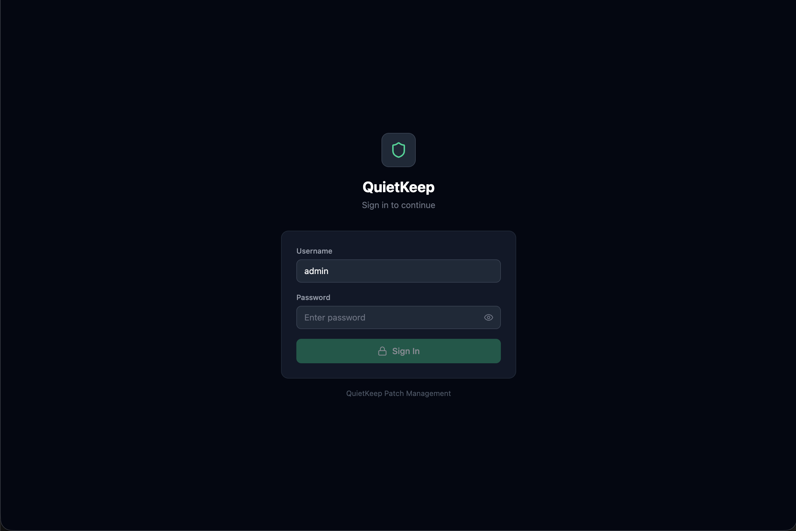
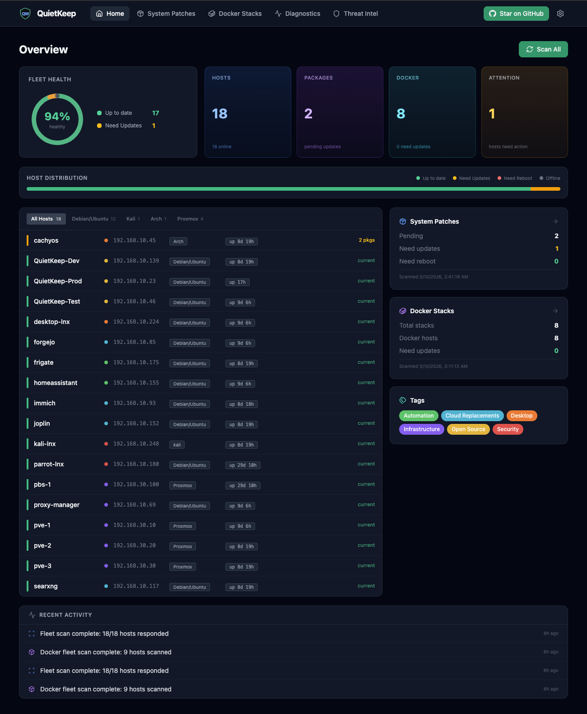
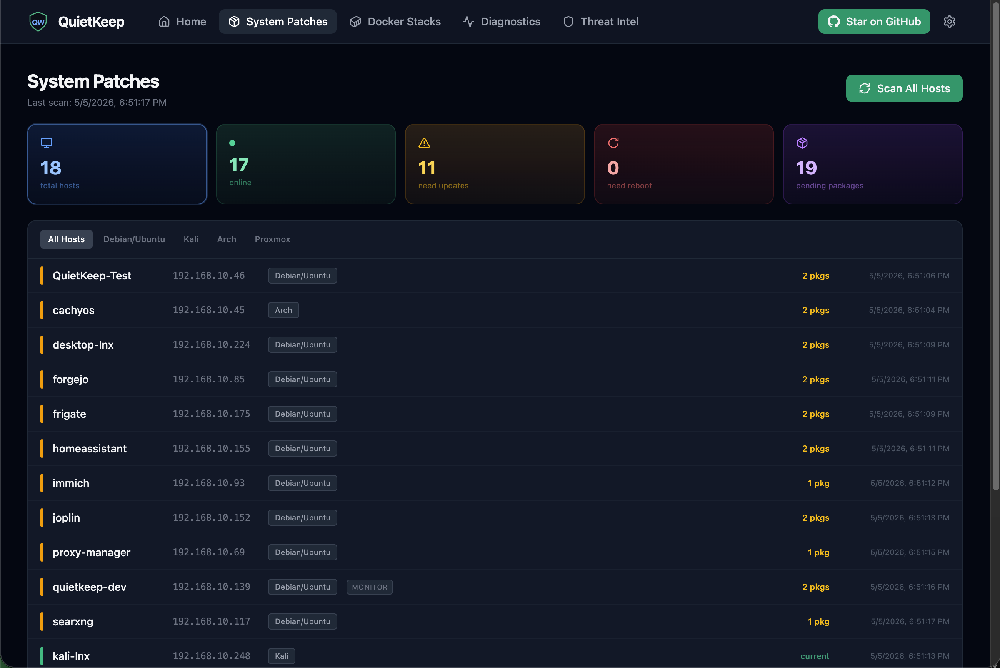
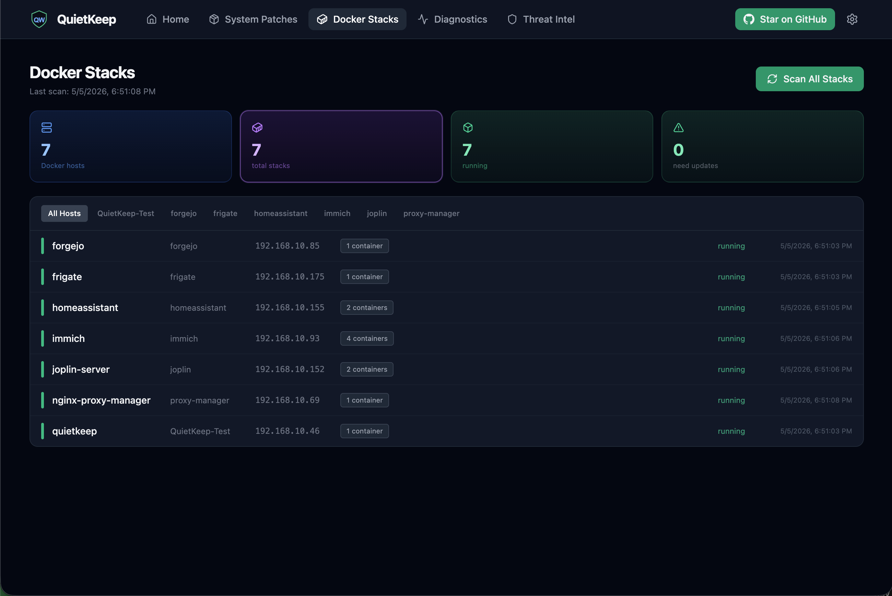
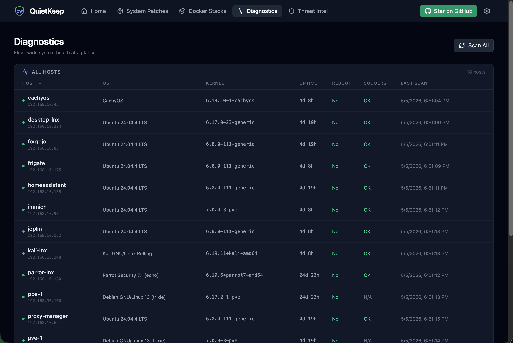
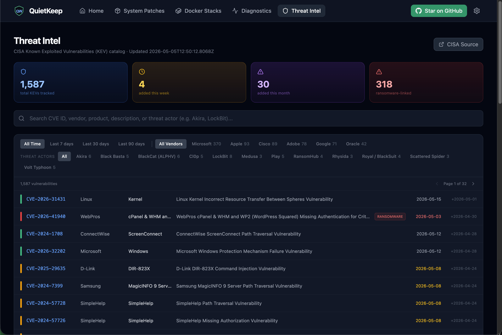
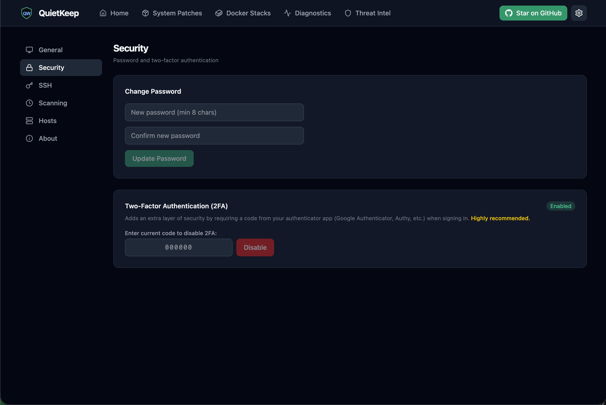
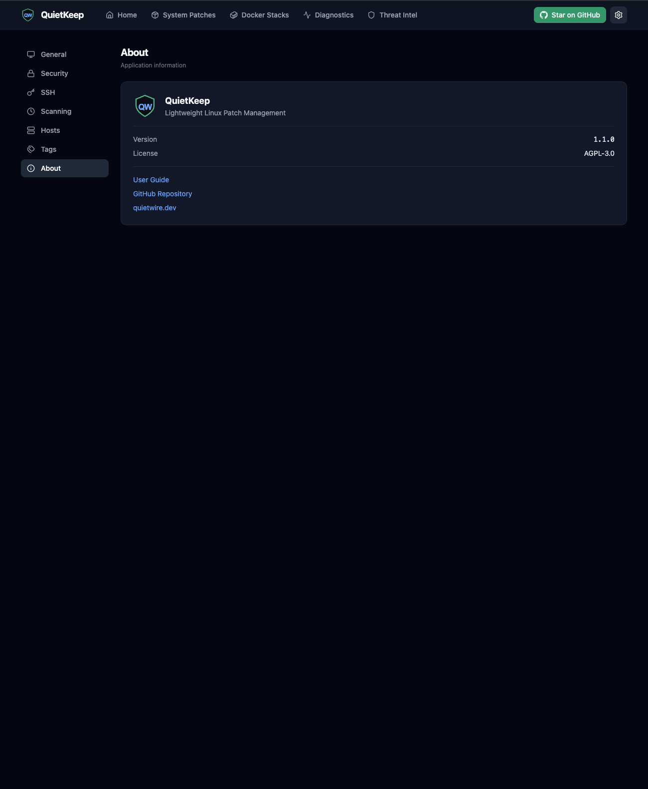

<p align="center">
  
  
  
  
</p>

# QuietKeep

**Lightweight Linux patch management and Docker stack maintenance from a single dashboard.**

QuietKeep is a self-hosted web application that lets you manage system updates and Docker containers across all your Linux hosts from one place. No agents to install. Everything works over SSH.

---

## What It Does

### System Patch Management
- **Scan** all your Linux hosts for available package updates
- **Patch** with one click. Applies security updates without upgrading your OS version
- **Track** patch history per host with full log output
- **Detect** when hosts need a reboot after kernel updates
- Supports **Debian/Ubuntu**, **Kali Linux**, **Arch/CachyOS**, and **Proxmox VE**

### Docker Stack Management
- **Discover** Docker Compose stacks automatically on any host
- **Detect** when container images have newer versions available
- **Update** stacks with one click. Pulls new images and recreates containers
- **View** update history with full logs
- **Release notes** links for quick access to changelogs

### Threat Intelligence
- **CISA KEV catalog** built in. Browse the Known Exploited Vulnerabilities database
- **Filter** by vendor, threat actor, or time range
- **Ransomware tracking** shows which CVEs are linked to ransomware campaigns
- Auto-updated from the official CISA feed

### Security
- **Single-user authentication** with admin login and JWT session cookies
- **Optional TOTP 2FA** via any authenticator app (Google Authenticator, Authy, 1Password, Bitwarden)
- **Password reset** via filesystem token (requires server access, no email or cloud)
- **All API routes protected** (except health check and auth endpoints)

### Dashboard & UX
- **Home overview** with at-a-glance status of all hosts and stacks
- **Clickable filter cards** let you drill into hosts that need updates, reboots, or Docker attention
- **Light, Dark, and System themes**
- **First-run wizard** with SSH key generation, host import, key deployment, and pre-flight checks
- **Settings page** for SSH config, scan intervals, security, and theme
- **Built-in Help** with searchable FAQ

---

## How It Works

```
  QuietKeep Server                 Managed Hosts
┌──────────────────┐          ┌─────────────────────┐
│  FastAPI Backend │── SSH ──▶│  apt / pacman       │
│  React Frontend  │          │  docker compose     │
│  SQLite DB       │          │  No agents needed   │
└──────────────────┘          └─────────────────────┘
```

QuietKeep connects to your hosts over SSH using key-based authentication. It runs standard system commands (`apt`, `pacman`, `docker compose`). Nothing is installed on the managed hosts.

---

## Tech Stack

| Layer | Technology |
|-------|-----------|
| Backend | Python 3.12, FastAPI, SQLAlchemy, asyncssh |
| Frontend | React 18, TypeScript, Tailwind CSS, Lucide icons |
| Database | SQLite (zero config) |
| Transport | SSH (key-based, no agents) |
| Deployment | Docker Compose (single container, builds from source) |

---

## Current Status

QuietKeep v1.0.0 is the first public release. All core features are functional and tested on an 18-host fleet.

### Shipped in v1.0.0
- ✅ Multi-OS host management (apt, pacman, kali, proxmox)
- ✅ One-click scanning and patching with full log capture
- ✅ Docker stack discovery and one-click updates
- ✅ Dashboard with filter cards, patch history, reboot detection
- ✅ Single-user authentication with optional TOTP 2FA
- ✅ First-run wizard with SSH key generation, host import, and key deployment
- ✅ Settings page with theme support, SSH configuration, and security settings
- ✅ Help page with searchable FAQ, bug reporting, and feature requests
- ✅ Threat Intel dashboard with CISA KEV catalog and ransomware tracking
- ✅ Docker Compose deployment with auto-detected IP and SSH key management via web UI
- ✅ Automated sudoers probing with one-click Fix Sudoers
- ✅ GPG key rotation detection with in-app secure recovery guidance (Kali/apt)
- ✅ Held-back package detection with opt-in kernel upgrade flow
- ✅ Fleet-wide Diagnostics tab with sortable OS, kernel, uptime, reboot, and sudoers columns
- ✅ Per-host Diagnostics card consolidating system health in one view
- ✅ Real OS name detection from `/etc/os-release` and kernel version probing via `uname -r`
- ✅ Scanning-in-progress banner with live feedback
- ✅ Password reset via filesystem token (no email or cloud required)

### Planned
- 📋 Email/webhook notifications for available updates
- 📋 Selective patching (choose which packages to update)
- 📋 Host groups and bulk operations
- 📋 Multi-user support with roles
- 📋 Pre-built Docker images on GitHub Container Registry

---

## Requirements

| Component | Minimum | Recommended |
|-----------|---------|-------------|
| CPU | 2 cores | 4 cores |
| RAM | 2 GB | 4 GB |
| Disk | 10 GB | 20 GB+ |
| Python | 3.11+ | 3.12 |
| Node.js | 18+ | 20+ (build only) |
| OS | Ubuntu 22.04+ / Debian 12+ | Ubuntu 24.04 |

**Managed hosts** need: SSH access with key-based auth, passwordless sudo for package commands. Docker features require Docker Engine 20.10+ with Compose v2 plugin.

---

## Screenshots

### Login


### Home Overview


### System Patches


### Docker Stacks


### Diagnostics


### Threat Intel


### Settings


### About


---

## Getting Started

```bash
git clone https://github.com/quietwire-dev/QuietKeep.git ~/quietkeep
cd ~/quietkeep
docker compose up -d --build
```

Open `https://YOUR_SERVER_IP` in your browser. You will see a self-signed certificate warning on the first visit (this is normal, see the [User Guide](docs/USER_GUIDE.md#3-access-the-web-ui) for details).

The first-run wizard walks you through creating your admin account, generating an SSH key, adding hosts, and deploying keys.

For a full walkthrough including Docker installation, firewall setup, and reverse proxy configuration, see the **[User Guide](docs/USER_GUIDE.md)**.

---

## Updating

To update to a newer version:

```bash
cd ~/quietkeep
git pull
docker compose up -d --build
```

Your data, settings, SSH keys, and certificates are stored in named Docker volumes and are not affected by rebuilds. Check the [Releases](https://github.com/quietwire-dev/QuietKeep/releases) page or [CHANGELOG](CHANGELOG.md) for what changed in each version.

---

## License

QuietKeep is open source software licensed under the [GNU Affero General Public License v3.0](LICENSE).

Copyright (C) 2026 QuietWire (Dennis Ayotte)

---

<p align="center">
  <strong>Built by <a href="https://quietwire.dev">QuietWire</a></strong>
</p>
